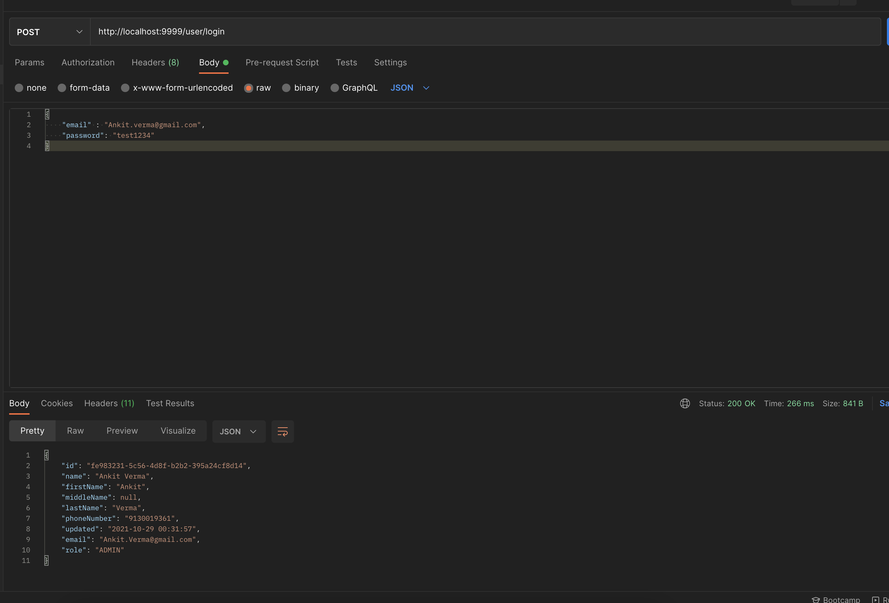
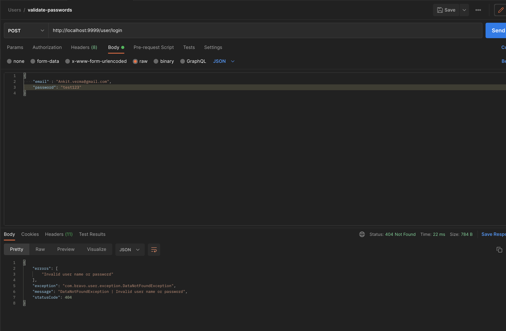
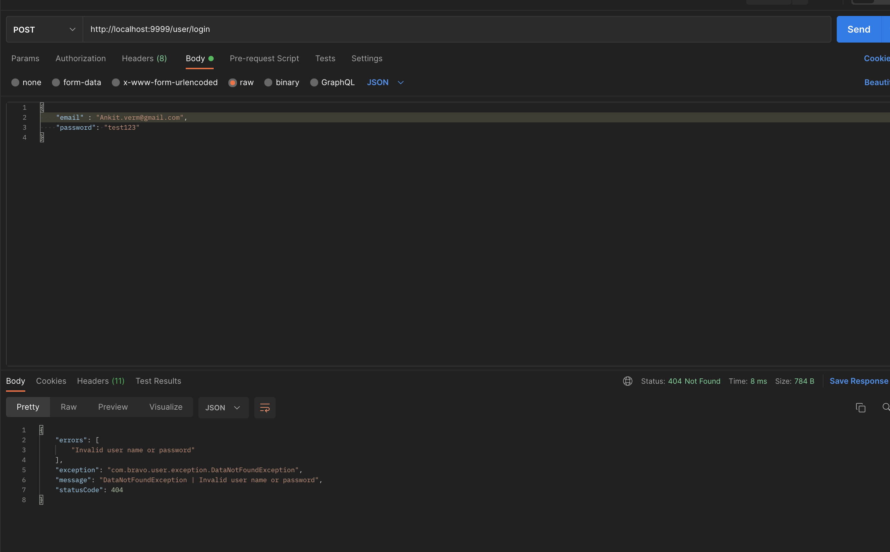
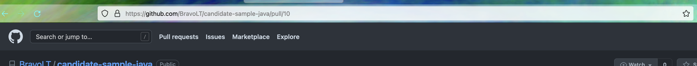

#### Update User DAO
    

####Update User DTO

#### Create New POST GET API to Validate User Password

Case When user id and password are correct.

Case When user id is valid and password os invalid.

Case when use id is invalid.

Update Data Seed to Update Mock Data
    Data seed is updated 
    created file named (data-mysql.sql)

Ensure the App Login API is Functioning Locally (screenshots)
    Screenshots attached

Write some jUnit to test the code added
    updated code. 

Raise PR into Original Repository when done (share screenshots)
    

